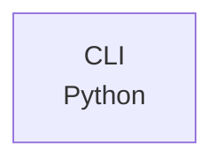

# dungeon

dungeon is a Windows command line tool that stores files in a hidden folder whose inner subfolder is named with a random SHA-512 hash and protected by a locally saved username, email, and hashed password. Its commands create the dungeon (`conceive`), move files in through a temporary folder (`seal`), open it after a login prompt (`unlock`), and rename the subfolder to a new hash (`lock`).

